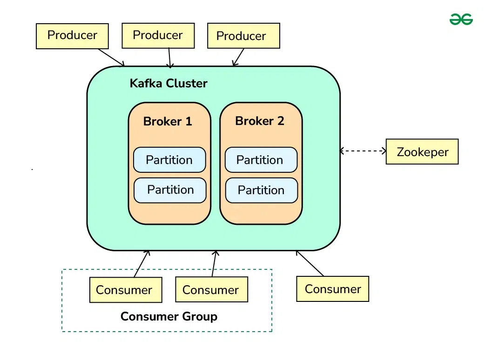
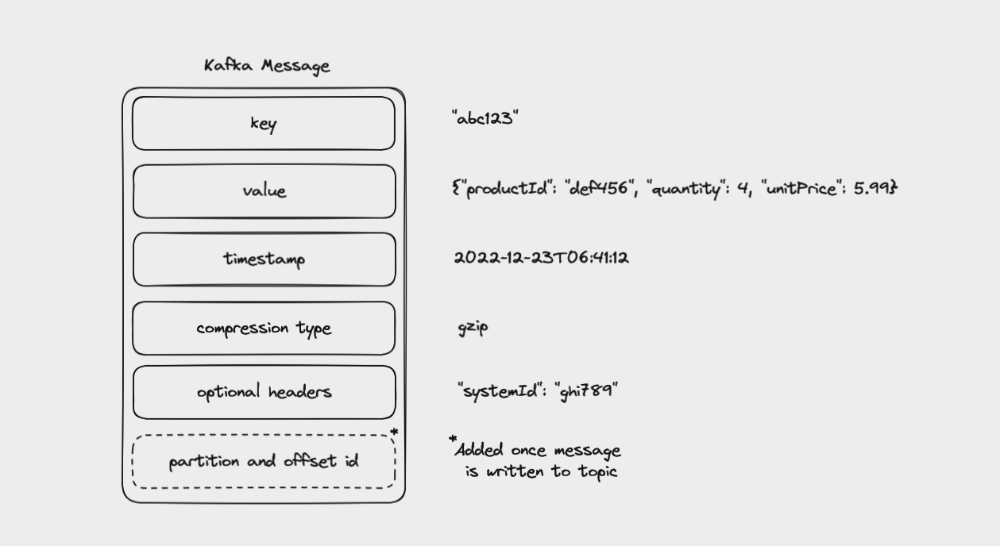

# Apache Kafka

## The Apache Kafka Handbook – How to Get Started Using Kafka

Apache Kafka is an open-source event streaming platform that can transport huge volumes of data at very low latency. Companies like LinkedIn, Uber, and Netflix use Kafka to process trillions of events and petabytes of data each day.

Kafka was originally developed at LinkedIn to help handle their real-time data feeds. It's now maintained by the Apache Software Foundation and is widely adopted in the industry, being used by 80% of Fortune 100 companies.

### Use Cases for Kafka:


- Personalizing recommendations for customers
- Notifying passengers of flight delays
- Payment processing in banking
- Online fraud detection
- Managing inventory and supply chains
- Tracking order shipments
- Collecting telemetry data from Internet of Things (IoT) devices

For example, Pinterest uses Kafka to handle up to 40 million events per second.

### Kafka's Key Features:
- **Distributed**: Runs as a cluster of nodes spread across multiple servers.
- **Replicated**: Data is copied in multiple locations to protect it from a single point of failure.
- **Fast**: Optimized for high throughput, making effective use of disk storage and batched network requests.

## Table of Contents


## Event Streaming and Event-Driven Architectures

Imagine you run Amazon, an e-commerce giant. Millions of customers place orders, make payments, and track shipments every second. How does Amazon manage all these events efficiently? This is where event streaming and event-driven architecture come in.

An event is simply a record of something happening.

**Example:**
- A customer places an order on Amazon → Order Placed Event
- The payment is processed → Payment Success Event
- The package is shipped → Order Shipped Event

These events are captured and processed in real-time.

Event streaming is the process of continuously capturing and processing events as they happen. Instead of waiting for reports at the end of the day, Amazon can immediately react to every customer action.

**Example:**
- You order an iPhone on Amazon.
- Amazon’s system instantly updates:
    - Reduces stock in the inventory.
    - Sends an email confirmation.
    - Updates delivery tracking.

All these actions are triggered by events happening in real-time.

Event-Driven Architecture (EDA) is a software design pattern where components react to events rather than following a fixed, sequential flow. Instead of services directly calling each other (as in traditional request-response systems), they communicate asynchronously through events.

As applications have become more complex, many organizations have adopted an event-driven architecture for their applications. This architecture helps ensure that if part of your application goes down, other parts won't also fail.

## Core Kafka Concepts




Kafka has become one of the most popular ways to implement event streaming and event-driven architectures. 
These core concepts are:

event messages
topics
partitions
offsets
brokers
producers
consumers
consumer groups
Zookeeper

### Event Messages in Kafka

When you write data to Kafka, or read data from it, you do this in the form of messages. You'll also see them called events or records.



A message consists of:
- a key
- a value
- a timestamp
- a compression type
- headers for metadata (optional)
- partition and offset id (once the message is written to a topic)

### Topics in Kafka

Kafka stores messages in a topic, an ordered sequence of events, also called an event log. Different topics are identified by their names and will store different kinds of events.

### Partitions in Kafka

In order to help Kafka to scale, topics can be divided into partitions. This breaks up the event log into multiple logs, each of which lives on a separate node in the Kafka cluster.

### Offsets in Kafka

Each message in a partition gets an id that is an incrementing integer, called an offset. Offsets start at 0 and are incremented every time Kafka writes a message to a partition.

### Brokers in Kafka

A single "server" running Kafka is called a broker. Multiple brokers working together make up a Kafka cluster. By running as a cluster, Kafka becomes more scalable and fault-tolerant.

### Replication in Kafka

To protect against data loss if a broker fails, Kafka writes the same data to copies of a partition on multiple brokers. This is called replication.

### Producers in Kafka

Producers are client applications that write events to Kafka topics. These apps aren't themselves part of Kafka – you write them.

### Consumers in Kafka

Consumers are client applications that read messages from topics in a Kafka cluster. Like with producers, you write these applications yourself and can make use of client libraries to support the programming language your application is built with.

### Consumer Groups in Kafka

An application that reads from Kafka can create multiple instances of the same consumer to split up the work of reading from different partitions in a topic. These consumers work together as a consumer group.

### Kafka Zookeeper

Kafka uses Zookeeper to manage the brokers in a cluster, and requires Zookeeper even if you're running a Kafka cluster with only one broker.

## How to Install Kafka on Your Computer

### Install Kafka on macOS

If you're using macOS, I recommend using Homebrew to install Kafka. It will make sure you have Java installed before it installs Kafka.

### Install Kafka on Windows (WSL2) and Linux

Kafka isn't natively supported on Windows, so you will need to use either WSL2 or Docker. I'm going to show you WSL2 since it's the same steps as Linux.

## How to Start Zookeeper and Kafka

### How to Start Kafka on macOS

In one terminal window, start Zookeeper with:
```sh
/usr/local/bin/zookeeper-server-start /usr/local/etc/zookeeper/zoo.cfg
```
In another terminal window, start Kafka with:
```sh
/usr/local/bin/kafka-server-start /usr/local/etc/kafka/server.properties
```

### How to Start Kafka on Windows (WSL2) and Linux

In one terminal window, start Zookeeper with:
```sh
~/kafka_2.13-3.3.1/bin/zookeeper-server-start.sh ~/kafka_2.13-3.3.1/config/zookeeper.properties
```
In another terminal window, start Kafka with:
```sh
~/kafka_2.13-3.3.1/bin/kafka-server-start.sh ~/kafka_2.13-3.3.1/config/server.properties
```

## The Kafka CLI

When you install Kafka, it comes with a Command Line Interface (CLI) that lets you create and manage topics, as well as produce and consume events.

### How to List Topics

To see the topics available on the Kafka broker on your local machine, use:
```sh
kafka-topics.sh --bootstrap-server localhost:9092 --list
```

### How to Create a Topic

To create a topic (with the default replication factor and number of partitions), use the `--create` and `--topic` options and pass them a topic name:
```sh
kafka-topics.sh --bootstrap-server localhost:9092 --create --topic my_first_topic
```

### How to Describe Topics

To describe the topics on a broker, use the `--describe` option:
```sh
kafka-topics.sh --bootstrap-server localhost:9092 --describe
```

### How to Partition a Topic

To create a topic with multiple partitions, use the `--partitions` option and pass it a number:
```sh
kafka-topics.sh --bootstrap-server localhost:9092 --create --topic my_second_topic --partitions 3
```

### How to Set a Replication Factor

To create a topic with a replication factor higher than the default, use the `--replication-factor` option and pass it a number:
```sh
kafka-topics.sh --bootstrap-server localhost:9092 --create --topic my_third_topic --partitions 3 --replication-factor 3
```

### How to Delete a Topic

To delete a topic, use the `--delete` option and specify a topic with the `--topic` option:
```sh
kafka-topics.sh --bootstrap-server localhost:9092 --delete --topic my_first_topic
```

### How to Use kafka-console-producer

You can produce messages to a topic from the command line using `kafka-console-producer`.

To create a producer connected to a specific topic, run:
```sh
kafka-console-producer.sh --bootstrap-server localhost:9092 --topic TOPIC_NAME
```

### How to Use kafka-console-consumer

You can consume messages from a topic from the command line using `kafka-console-consumer`.

To create a consumer, run:
```sh
kafka-console-consumer.sh --bootstrap-server localhost:9092 --topic TOPIC_NAME
```

### How to Use kafka-consumer-groups

You can run consumers in a consumer group using the Kafka CLI. To view the documentation for this, run:
```sh
kafka-consumer-groups.sh
```

## How to Build a Kafka Client App with Java

### How to Set Up the Project

I recommend using IntelliJ for Java projects. Create a new Maven project in IntelliJ.

### How to Install the Dependencies

Open up `pom.xml` and inside the `<project>` element, create a `<dependencies>` element. Add the following dependencies:
```xml
<dependency>
    <groupId>org.apache.kafka</groupId>
    <artifactId>kafka-clients</artifactId>
    <version>3.3.1</version>
</dependency>
<dependency>
    <groupId>org.slf4j</groupId>
    <artifactId>slf4j-api</artifactId>
    <version>2.0.6</version>
</dependency>
<dependency>
    <groupId>org.slf4j</groupId>
    <artifactId>slf4j-simple</artifactId>
    <version>2.0.6</version>
</dependency>
```

### How to Create a Kafka Producer

Create a `Producer` class and configure the producer properties:
```java
Properties properties = new Properties();
properties.setProperty(ProducerConfig.BOOTSTRAP_SERVERS_CONFIG, "localhost:9092");
properties.setProperty(ProducerConfig.KEY_SERIALIZER_CLASS_CONFIG, StringSerializer.class.getName());
properties.setProperty(ProducerConfig.VALUE_SERIALIZER_CLASS_CONFIG, StringSerializer.class.getName());

KafkaProducer<String, String> producer = new KafkaProducer<>(properties);
ProducerRecord<String, String> producerRecord = new ProducerRecord<>("lotr_characters", "hobbits", "Bilbo");
producer.send(producerRecord);
producer.close();
```

### How to Send Multiple Messages and Use Callbacks

To send multiple messages and use callbacks, update the `Producer` class:
```java
HashMap<String, String> characters = new HashMap<>();
characters.put("hobbits", "Frodo");
characters.put("hobbits", "Sam");
characters.put("elves", "Galadriel");
characters.put("elves", "Arwen");
characters.put("humans", "Éowyn");
characters.put("humans", "Faramir");

for (HashMap.Entry<String, String> character : characters.entrySet()) {
    ProducerRecord<String, String> producerRecord = new ProducerRecord<>("lotr_characters", character.getKey(), character.getValue());
    producer.send(producerRecord, (RecordMetadata recordMetadata, Exception err) -> {
        if (err == null) {
            log.info("Message received. \n" +
                    "topic [" + recordMetadata.topic() + "]\n" +
                    "partition [" + recordMetadata.partition() + "]\n" +
                    "offset [" + recordMetadata.offset() + "]\n" +
                    "timestamp [" + recordMetadata.timestamp() + "]");
        } else {
            log.error("An error occurred while producing messages", err);
        }
    });
}
producer.close();
```

### How to Create a Kafka Consumer

Create a `Consumer` class and configure the consumer properties:
```java
Properties properties = new Properties();
properties.setProperty(ConsumerConfig.BOOTSTRAP_SERVERS_CONFIG, "localhost:9092");
properties.setProperty(ConsumerConfig.KEY_DESERIALIZER_CLASS_CONFIG, StringDeserializer.class.getName());
properties.setProperty(ConsumerConfig.VALUE_DESERIALIZER_CLASS_CONFIG, StringDeserializer.class.getName());
properties.setProperty(ConsumerConfig.GROUP_ID_CONFIG, "lotr_consumer_group");
properties.setProperty(ConsumerConfig.AUTO_OFFSET_RESET_CONFIG, "earliest");

KafkaConsumer<String, String> consumer = new KafkaConsumer<>(properties);
consumer.subscribe(Arrays.asList("lotr_characters"));

while (true) {
    ConsumerRecords<String, String> messages = consumer.poll(Duration.ofMillis(100));
    for (ConsumerRecord<String, String> message : messages) {
        log.info("key [" + message.key() + "] value [" + message.value() + "]");
        log.info("partition [" + message.partition() + "] offset [" + message.offset() + "]");
    }
}
```

### How to Shut Down the Consumer

Wrap the consumer code in a try-catch-finally block to handle shutting down the consumer:
```java
try {
    consumer.subscribe(Arrays.asList("lotr_characters"));
    while (true) {
        ConsumerRecords<String, String> messages = consumer.poll(Duration.ofMillis(100));
        for (ConsumerRecord<String, String> message : messages) {
            log.info("key [" + message.key() + "] value [" + message.value() + "]");
            log.info("partition [" + message.partition() + "] offset [" + message.offset() + "]");
        }
    }
} catch (Exception err) {
    log.error("Error: ", err);
} finally {
    consumer.close();
    log.info("The consumer is now closed");
}
```

## Where to Take it From Here

Congratulations on making it this far. You've learned:
- The main concepts behind Kafka
- How to communicate with Kafka from the command line
- How to build a Java app that produces to and consumes from Kafka

There's plenty more to learn about Kafka, whether that's Kafka Connect for connecting Kafka to common data systems or the Kafka Streams API for processing and transforming your data.

Some resources you might find useful as you continue your journey with Kafka are:
- The official Kafka docs
- Courses from Confluent
- Conduktor's kafkademy
